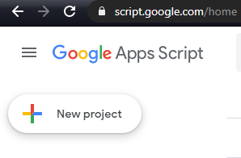
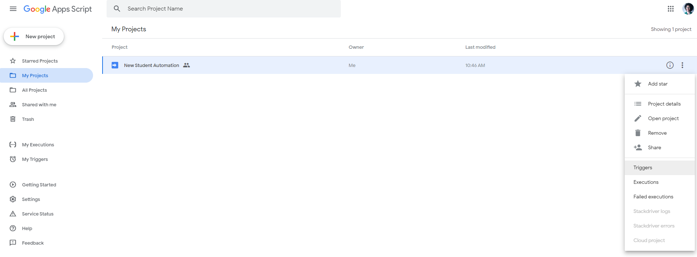
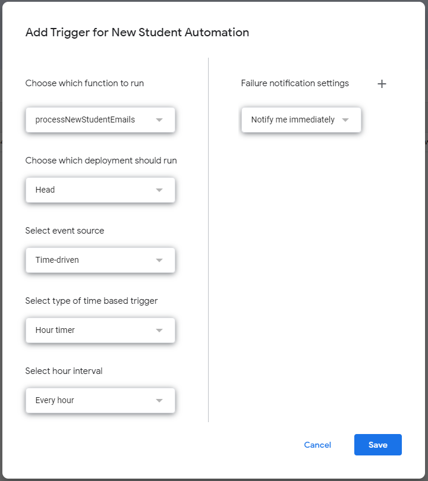

# New Student Assignment to Spreadsheet Automation

Use this script to automatically add new student information (class code, graduation date, student name, and student email) directly to the Student Roster spreadsheet.

#### NOTE

This script only works with a Gmail account

## How To Use

1. Copy the source code from here (you'll want all three files. Code.gs, messages.html, and parsed.html): https://script.google.com/d/1TikNuUokzR7OAcGlgNdCVTjbq-67gN__feigHFbJwaxO6ApDRCS6DLqE/edit?splash=yes
2. go to script.google.com
3. click the New Project button 
4. Copy the files into your new project.
   1. Change line 58 in Code.gs. Here you will put the URL to your spreadsheet.
   2. You may change the last argument on line 8. This will be the number of emails that will be searched (default 4)
   3. Also fill in your name and link to calendly on lines 121 and 123 for the intro email
5. Deploy the project as a web app and accept the OAuth. 
6. Back on the project page, click the hamburger menu>Triggers 
7. Add a trigger that runs the `processNewStudentEmails` function. You may choose whatever time interval you'd like, here is the recommended default:
8. Click save and you should see new students directly added to your spreadsheet!

## Changelog

#### 11/7/2020

- added function that adds students to Google Contacts
- Contacts all go into a group for easy sending of weekly blast email

#### 11/9/2020

- added function that automatically sends intro email
  - don't forget to add your name and calendly link to the code (lines 121 and 123 of `Code.js`)

## Future Development

- scrape Github Username and Time Difference as well
- convert into extension so user does not have to create own project
- ~~auto send intro email~~
- auto create zoom link for recurring meeting and add it to the spreadsheet

## Acknowledgements

Thanks Parsanth Janardanan, writer of the guide I used to build this (https://blog.gsmart.in/parse-and-extract-data-from-gmail-to-google-sheets/)

Thanks to John Blackwell for help with the RegExp and Queen Shabazz for checking in